<h1 align="center">pwnagotchi theme manager</h1>

<p align="center">
Full-color themes, animated effects, mood-reactive faces and a touch menu for the 3.5" LCD of your
<a href="https://pwnagotchi.org">pwnagotchi</a>.
</p>

<p align="center">
<a href="https://github.com/Korrie71/pwnagotchi-theme-manager/actions/workflows/tests.yml"></a>


</p>

<p align="center">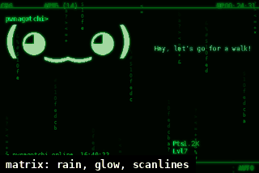</p>

Pwnagotchi draws its screen in black and white. This plugin recolors it live: pick a theme and you get colors,
gradients, glow, scanlines, rain, stars, per-element colors, custom text with live values, and a face that changes color
with pwnagotchi's mood. Themes are small JSON files you can edit in a web editor or by hand and share.

## Contents

[Features](#features) · [Screenshots](#screenshots) · [Install](#install) · [Use](#use) · [Make your own theme](#make-your-own-theme) ·
[Known limits](#known-limits) · [How it works](#how-it-works) · [Development](#development) · [Contributing](#contributing) · [Legal](#legal) · [License](#license)

## Features

- **28 built-in themes, 20 with scenery** painted behind the text (the `scene` effect): mountains, ocean, forest, desert, volcano, aurora, the four seasons, a Star Trek console, an LCARS instrument panel, a neon city and more; a few even have a small animal wandering through (a dolphin, a whale, a fox, a scorpion, a penguin, an owl)
- **Colors and gradients** for ink, background and the top/bottom bars
- **Effects:** glow, scanlines, vignette, film grain, pulse, rainbow, glitch, matrix rain, twinkling stars, border
- **Per-element colors:** face, name, status, stats and any plugin's on-screen items each get their own color
- **Custom text lines** with live placeholders (`{time}`, `{cpu}`, `{temp}`, `{ip}`, `{gps}`, `{handshakes}`, `{cracked}`, `{power}`...) and scrolling marquees
- **Mood-reactive themes:** colors and effects follow pwnagotchi's face (sad, angry, happy...), with smooth blending and a flash on new handshakes
- **Face packs:** replace the text face with PNG or GIF images per mood, in color or tinted by the theme
- **Web editor** with live preview: sliders, gradient picker, drag-to-place text, click a part of the preview to recolor it, import/export; installable on a phone home screen
- **Touch menu:** double tap the screen to switch themes (or just swipe sideways), enable/disable pwnagotchi plugins on the fly, or see system status and restart/reboot/shut down
- **Sonar radar:** a rotating sweep showing nearby networks as blips (distance = signal strength, a stable bearing per device); tap one for details. Display-only, never affects what gets attacked
- **Cracking dashboard:** every captured handshake with its upload/crack status, a local handshake-quality guess (full/PMKID/partial/junk), and its location if pwnagotchi’s gps plugin has one, on the screen and in the editor
- **GPS map:** an OpenStreetMap view of your own captured handshakes in the web editor, with a plain-list fallback if the map tiles cannot load
- **Nodes:** pair with other units (a Pi Zero W running the small `node_pwn.py` companion) so a group covers more distinct ground instead of each attacking the same network twice. One in WiFi range shows up on its own over pwnagotchi's own mesh — no shared network needed at all; failing that, scan the local network, or add one directly by address (a VPN, or a forwarded port) from the web editor. A paired node's captures mark a network as already covered on the Radar, and can optionally (off by default) actually be skipped, not just shown covered. Going out together also gets its own **Wardrive** trip log — a start/stop gps breadcrumb trail, distance, unique networks seen and handshakes captured, shown on an OpenStreetMap route in the web editor
- **Move anything on the screen:** tap an element in the touch menu and nudge it with small `+` and `-` buttons (or do it in the web editor)
- **Achievements:** unlock them for handshakes, uptime, themes tried and more, on the screen and in the editor
- **Overheating auto-off (optional):** a countdown on the screen, then the Pi shuts itself down; a touch cancels it
- **Attack modes:** Aggressive (normal), Passive recon (deauth/associate off), or Home defense (passive, plus a warning if a new device starts broadcasting one of your own network names)
- **Night mode:** dim the screen by hand, on a schedule, or after a few minutes without a touch
- **Warnings:** a banner on the screen for low power and high temperature
- **Safe experiments:** try a theme for 30 seconds, then it goes back by itself; back up, restore, share and import themes and face packs from the editor
- **Light and cool:** only changed screen rows are sent to the display, static parts are cached, animation slows down when the Pi gets hot, and a watchdog resets bettercap's GPS module if it loses its device (which can burn a whole CPU core)

## Screenshots

Everything below is rendered from made-up data (a fake name, fake stats) by the plugin's own drawing code. You can
regenerate the images with `python tools/make_screenshots.py`.

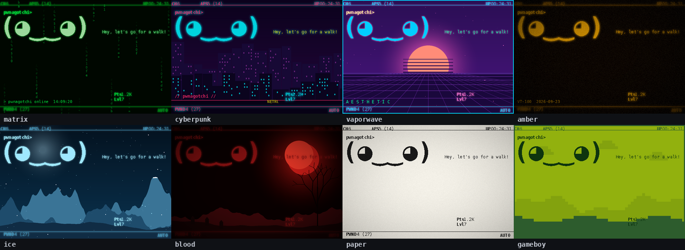

And more, each with its own scenery: a Star Trek console, the seasons, landscapes and holidays.

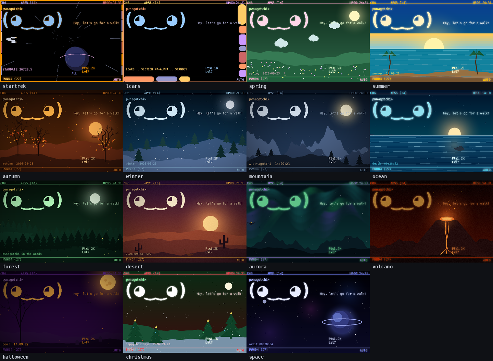

**Mood-reactive themes** change colors and effects with pwnagotchi's face:

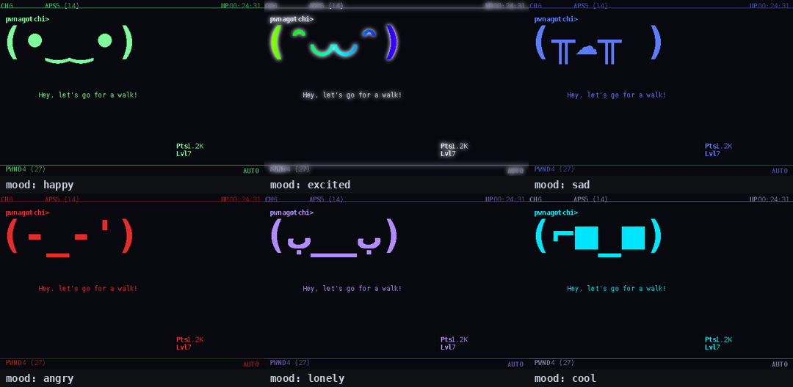

**Face packs** replace the text face with images, in color or tinted by the theme:

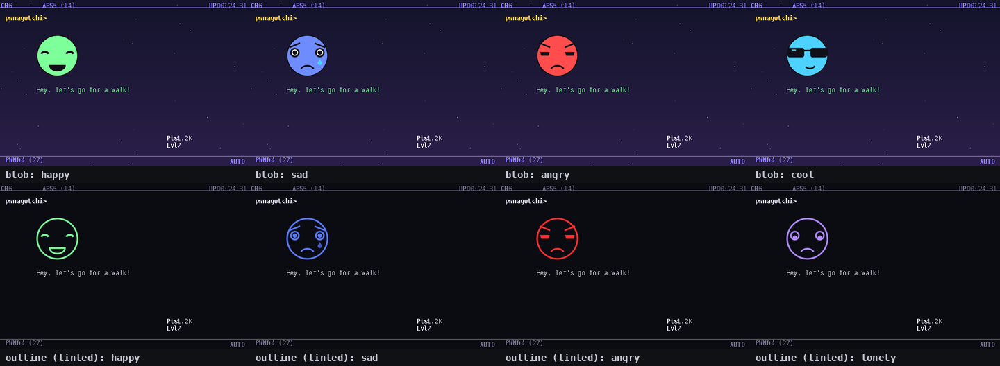

**Touch menu** (double tap the screen): themes, plugins, system, awards, layout, radar and nodes:

<p>
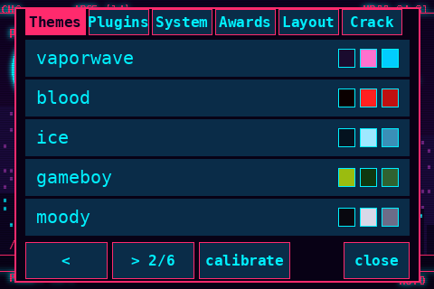
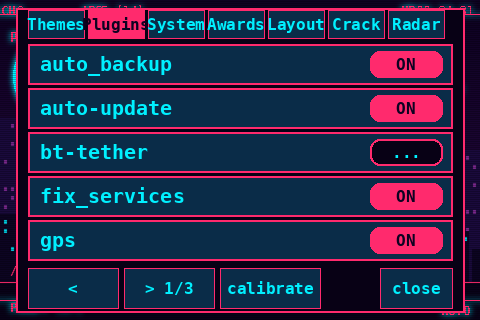
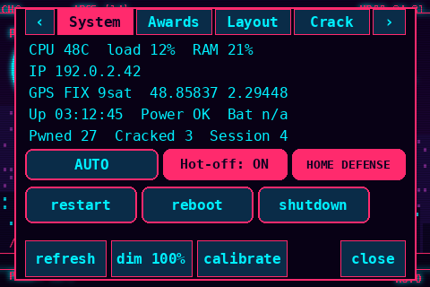
</p>
<p>
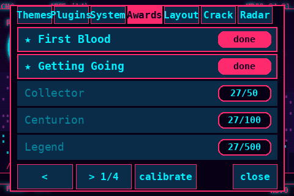
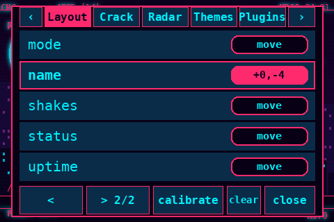
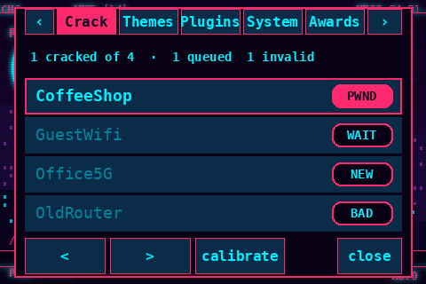
</p>
<p>
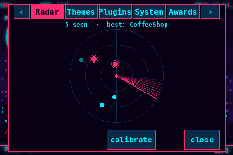
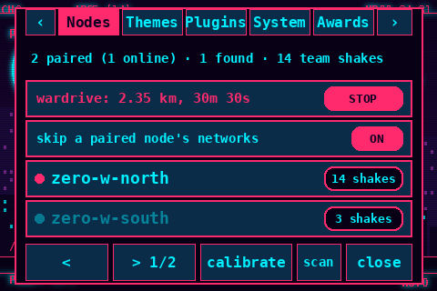
</p>

**Web editor** with a live preview: drag text lines on the preview, or click a part of the screen to recolor it.

<p>
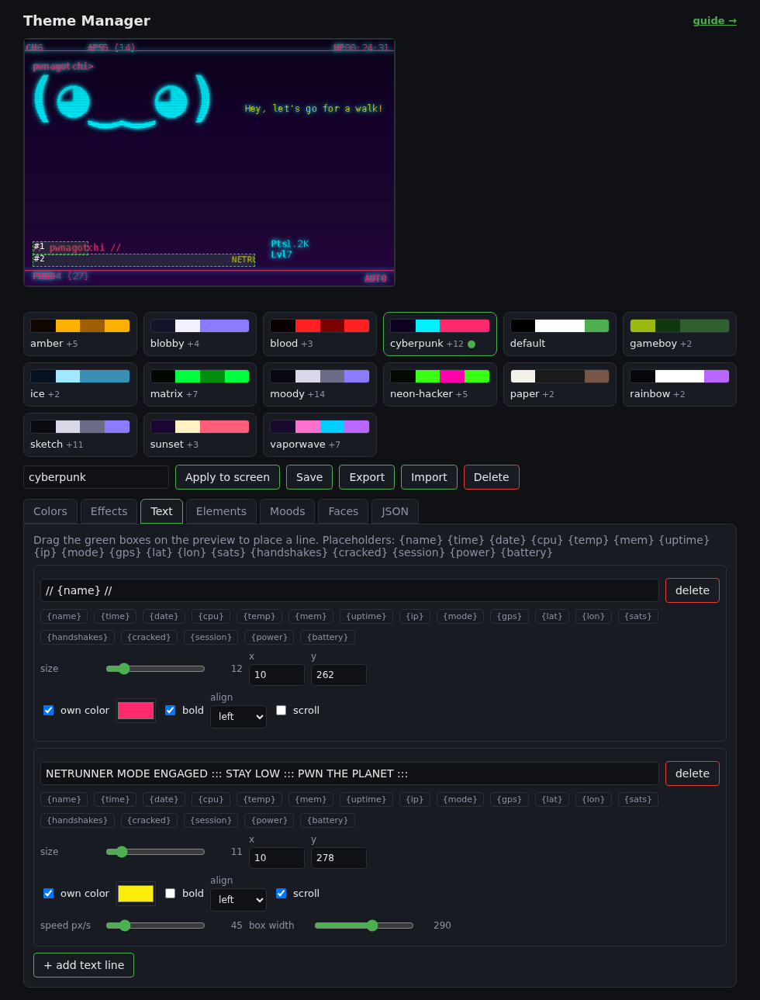
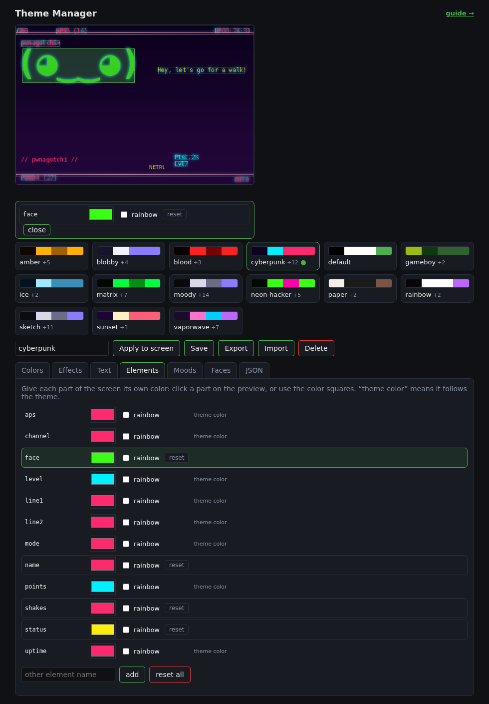
</p>

## Install

### 0. Getting pwnagotchi itself onto the hardware

Not this project — you need a working pwnagotchi before any of the guides below apply. Skip this if you already
have one running.

1. **Get the image.** Use the [jayofelony fork](https://github.com/jayofelony/pwnagotchi)'s
   [latest release](https://github.com/jayofelony/pwnagotchi/releases/latest) — one 64-bit `.img.xz` for every
   supported board (Pi Zero 2 W, Pi 3, Pi 4, Pi 5, ...). Recent releases dropped 32-bit support entirely, which
   means the *original* Pi Zero W (single-core, no 64-bit) is no longer supported by current images; a **Pi Zero 2 W**
   or newer is what you want.
2. **Flash it** with the [Raspberry Pi Imager](https://www.raspberrypi.com/software/): "Choose OS" → "Use custom" →
   pick the `.img.xz` you downloaded → pick your SD card. When it asks about applying OS customization/settings,
   say **no** — the image already has everything it needs, and overwriting that can break first boot.
3. **Connect to it.** No display or keyboard needed: plug a USB cable into the port closest to HDMI (Zero W/2 W) or
   the USB-C/USB-A port (Pi 4/5) and your computer, install the RNDIS driver if you're on Windows, then
   `ssh pi@pwnagotchi.local` (password `raspberry`). A Pi 4/5 can also just take an ethernet cable instead.

Full step-by-step (and troubleshooting) is in the [jayofelony wiki](https://github.com/jayofelony/pwnagotchi/wiki).
Once you're SSH'd in with pwnagotchi running, come back here.

### 1. This plugin (the main unit with the screen)

Requirements: pwnagotchi 2.9.x (the jayofelony fork) with a `waveshare35lcd` display. Pillow, numpy and Flask are already
part of pwnagotchi. The touch menu additionally needs a touchscreen that shows up under `/dev/input`
(for example an ADS7846/XPT2046 controller).

Screen not working yet (white screen, no `/dev/fb*`)? Start with the [display setup guide](docs/DISPLAY-SETUP.md).

```bash
git clone https://github.com/Korrie71/pwnagotchi-theme-manager.git
cd pwnagotchi-theme-manager
sudo ./install.sh --restart
```

`install.sh` copies the plugin, the guide, example themes and face packs, and enables the plugin in `config.toml` (it
backs the file up first, and never overwrites your own themes). Run `./install.sh --help` for the options, and
`sudo ./install.sh --uninstall` to remove it again.

<details>
<summary>Install by hand instead</summary>

```bash
sudo cp theme_manager.py /etc/pwnagotchi/custom-plugins/
sudo mkdir -p /etc/pwnagotchi/themes/faces
sudo cp docs/THEMES.md /etc/pwnagotchi/themes/README.md              # the guide shown in the web editor
sudo cp themes/*.json /etc/pwnagotchi/themes/                        # optional example themes
sudo cp -r faces/blob faces/outline /etc/pwnagotchi/themes/faces/    # optional example face packs
```

Then add this to `/etc/pwnagotchi/config.toml` and run `sudo systemctl restart pwnagotchi`:

```toml
[main.plugins.theme_manager]
enabled = true
```

</details>

### 2. `node_pwn` (any other units you want to pair with)

On a second pwnagotchi you want to pair with (a Pi Zero 2 W wardriving alongside this one, say — same Step 0 above
to get pwnagotchi onto it first), install the small `node_pwn.py` companion instead of the full theme manager.
SSH into *that* unit and either clone the repo there too, or just copy the two files over from this one:

```bash
# on the other unit
git clone https://github.com/Korrie71/pwnagotchi-theme-manager.git && cd pwnagotchi-theme-manager
sudo ./Node_PWN.sh --restart
```

```bash
# or, from this unit, copy just the two files it needs over SSH
scp Node_PWN.sh node_pwn.py pi@<other-unit-address>:~/
ssh pi@<other-unit-address> 'sudo bash ~/Node_PWN.sh --restart'
```

Nothing to configure: it starts advertising over pwnagotchi's own local mesh right away (the same beacon-frame
broadcast already used for two nearby units to notice each other), so once it is back up it should just show up on
this (the "main") unit's **Nodes** tab — touch menu or web editor — on its own, no shared network required, just
ordinary WiFi range. It also answers a small, read-only status API on its own web UI, if you would rather check with
`curl http://<other-unit-address>:8080/plugins/node_pwn/api/info`, or the two units *are* reachable over IP: the web
editor's Nodes tab can scan the local network too, or add a specific address directly (a VPN/Tailscale IP, or a port
you have forwarded to it) for one that is neither in mesh range nor on this network. See [Use](#use) below.

## Use

**Web editor:** open `http://<pi-address>:8080/plugins/theme_manager/`. Pick a theme, change colors and effects, drag text
lines on the preview, click a part of the screen to recolor it, then **Apply to screen**. Themes you save appear in the list.
The **Layout**, **Awards**, **Cracking**, **Radar**, **Map**, **Nodes** (which also has the Wardrive trip log) and **Settings** tabs
(overheating auto-off, achievements, brightness and night mode) are about the device rather than the theme.

**Command line** (use pwnagotchi's Python):

```bash
P="sudo /opt/.pwn/bin/python3 /etc/pwnagotchi/custom-plugins/theme_manager.py"
$P list                  # themes, * = active
$P set matrix            # switch theme (applies within seconds)
$P new mytheme           # create a template to edit
$P validate FILE.json    # check a theme file
$P mood sad 20           # preview a mood for 20 seconds
$P overheat on 85 60     # turn the Pi off after 60 s at 85 C (or: overheat off)
$P achievements off      # stop keeping track of achievements (or: on)
$P layout show           # what was moved on the screen (or: layout reset)
$P cracking              # handshake upload/crack counts as JSON (or: cracking list)
$P mode                  # show the attack mode (or: mode passive / mode home)
```

**Touch menu:** double tap the screen (two quick taps in about the same place). The first time you are asked to tap four
`+` marks in the corners to calibrate. Then:

| tab | what it does |
|---|---|
| **Themes** | switch theme with one tap |
| **Plugins** | every installed plugin with an `ON`/`OFF` switch that takes effect immediately and is saved to `config.toml`; a plugin that fails to load shows `ERR` and is set back to disabled |
| **System** | temperature, load, RAM, IP, GPS status, uptime, power state, handshake counts; `restart`, `reboot`, `shutdown` and AUTO/MANU mode buttons that each need a second tap to confirm; `Hot-off` switches the overheating auto-off on and off; an attack-mode button cycles Aggressive/Passive/Home defense; `refresh` redraws the whole screen to clear a glitchy panel; `dim` cycles the brightness |
| **Awards** | the achievements with your progress; tap one to see what it asks for |
| **Layout** | every element on the screen; tap one to move it with `X -` `X +` `Y -` `Y +` (1, 5 or 10 pixels per tap), `reset` and `done`; `clear` puts everything back |
| **Crack** | every captured handshake with a status pill (`PWND`/`WAIT`/`NEW`/`BAD`/`?`); tap one for the password, quality guess, or location if it has one |
| **Radar** | a rotating sonar sweep of nearby networks; tap a blip for its name, encryption, client count, signal, and whether you already have its handshake. Display-only — it never affects what pwnagotchi attacks |
| **Nodes** | a **Wardrive** row at the top — tap it to start/stop a trip log, showing distance, duration, unique networks seen and handshakes captured since it started (the full gps breadcrumb trail and route map are in the web editor's Nodes tab); display-only, it never affects what pwnagotchi attacks. Below it, a row to actually skip a network a paired, online node already captured (off by default) — the same live, no-restart-needed mechanism as the attack mode, not just showing it covered on the Radar. Then other units running `node_pwn`: one in WiFi range shows up here on its own, over pwnagotchi's own mesh (no shared network needed). `scan` also checks the local network. Tap a found one to pair, tap a paired one and tap again to unpair. Shows name (a nickname you gave it in the web editor, if any, otherwise its own reported name), address (or signal, for a mesh find), handshake count, and online, or offline with how long ago it was last seen. The summary line adds up the team's combined handshake total from every node currently online. A node that is neither in mesh range nor on this network can be added by address instead, from the web editor's Nodes tab (no keyboard here to type one with) |

Swipe sideways on the bare screen to change theme. `close`, a tap outside the menu, or 20 seconds of nothing closes it. It costs nothing while idle: one thread sleeps until
the screen is touched.

## Make your own theme

A theme is one JSON file in `/etc/pwnagotchi/themes/`:

```json
{
  "bg": "#0d0221", "fg": "#00f0ff", "accent": "#ff2a6d", "web": "#ff2a6d",
  "gradient": {"from": "#0d0221", "to": "#2a0845", "direction": "vertical"},
  "effects": [{"type": "glow", "radius": 3}, {"type": "glitch", "interval": 5}, "scanlines"],
  "elements": {"face": "#00f0ff", "name": "#ff2a6d"},
  "text": [{"text": "{name} {time}  {ip}", "x": 10, "y": 278, "size": 12}],
  "mood": {"sad": {"fg": "#5b7cff", "elements": {"face": "#5b7cff"}}}
}
```

The full guide (every field, effect, placeholder, mood and face pack) is in [docs/THEMES.md](docs/THEMES.md), and the
web editor links to it. Two example themes are in [`themes/`](themes), and two face packs in [`faces/`](faces).

## Known limits

- **Display:** it only supports pwnagotchi's `waveshare35lcd` framebuffer display (480x320, 16-bit). On any other display
  the plugin loads, says so in the log, and does nothing.
- **Version:** developed and tested on pwnagotchi 2.9.5.9 (jayofelony fork) on a Raspberry Pi 5.
- **Colors:** pwnagotchi draws in 1 bit, so individual on-screen elements can be recolored, but a single element can't
  contain several colors of its own. Face packs (images) can.
- **Touch:** the touch menu needs a touchscreen that appears as an input device; without one it is simply disabled.
- **Power buttons:** `restart`, `reboot` and `shutdown` in the System tab do what they say. Each needs a second tap.
- **Config file:** pwnagotchi rewrites `config.toml` from memory whenever a plugin is toggled. The touch menu keeps
  `personality.channels` exactly as it is on disk; toggling from the web plugin page does not, so check that line if you
  rely on `channels = []`.
- **GPS values** (`{gps}`, `{lat}`, `{lon}`, `{sats}`) need pwnagotchi's `gps` plugin, which enables bettercap's GPS module.

## How it works

Pwnagotchi renders a 1-bit canvas. The plugin wraps the display's `render()` and recolors each frame, and wraps each UI
element's `draw()` to learn which pixels belong to which element. Only changed screen rows are written to the
framebuffer, static parts are cached, and animation slows down when the system is busy. The touch menu reads raw
`input_event`s from the touch controller itself and is calibrated with four taps (stored in
`/etc/pwnagotchi/themes/touch.json`). The web accent color of pwnagotchi's own UI follows the active theme.

## Development

The tests need only `numpy` and `Pillow`, not a Raspberry Pi: a small stand-in for pwnagotchi lives in
[`tests/stubs`](tests/stubs).

```bash
pip install numpy pillow
python tests/run_all.py            # or run any tests/test_*.py on its own
```

They cover theme validation and rendering (including a fuzz test), per-element colors, moods, face packs, the touch
menu and calibration, plugin switching, the System tab, achievements, the layout mover, the cracking dashboard, the
sonar radar, node scanning and pairing (`node_pwn.py` and its own `Node_PWN.sh` installer included), attack modes,
the web API, the placeholders, the install script, and a scan that keeps
personal data out of the repository. The tools in [`tools/`](tools) regenerate the screenshots and the demo GIF from
made-up data. GitHub Actions runs the tests on every push.

## Contributing

Themes, face packs, bug reports and ideas are welcome, see [CONTRIBUTING.md](CONTRIBUTING.md). Please never post
screenshots or logs that show your device name, network names or addresses.

## Legal

pwnagotchi itself, and the `wpa-sec` and cracking dashboard features this plugin adds a view onto, are for
**authorized security testing, research and education only**. Only use them on networks and devices you own or have
explicit permission to test. You are responsible for complying with all applicable laws; the authors and contributors
take no responsibility for misuse. The plugin shows this once, on its first run, on the device's own screen:

<p align="center">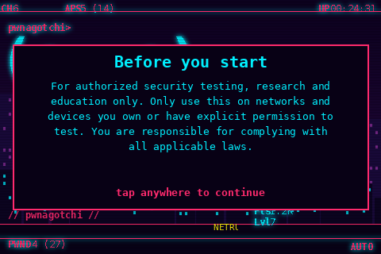</p>

## License

GPL-3.0, see [LICENSE](LICENSE).
